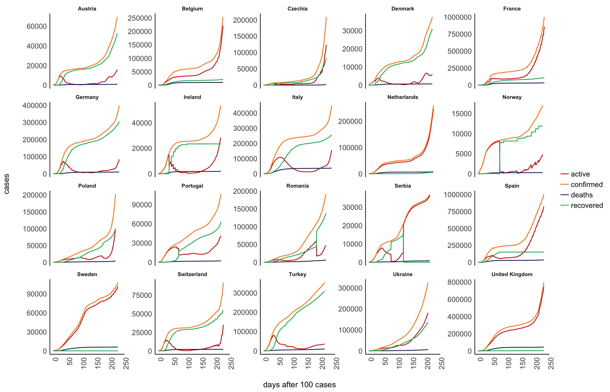
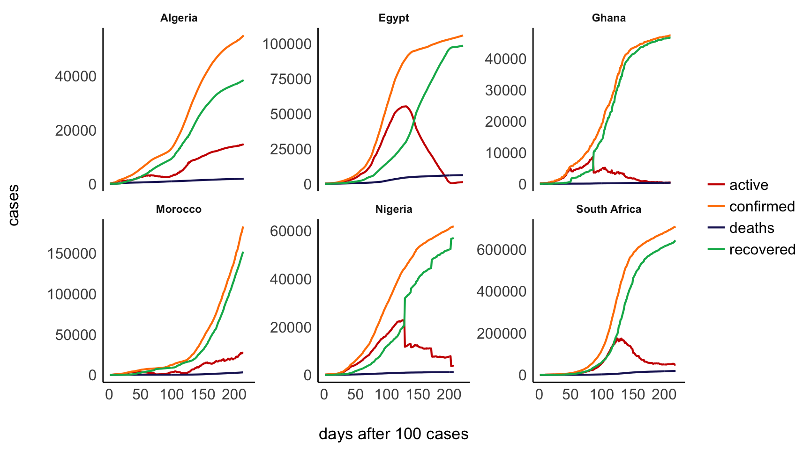

# Visualizing the Corona (COVID-19) pandemic

## Basic idea

I generally think that the news do a good job in describing and
visualizing the corona pandemic. However, there are two things that I
believe are quite problematic and that I am missing the any news
coverage on the pandemic.

1.  Visualizations of the growth curves often log-transform the x-axis
    instead of showing the actual *exponential* growth.
2.  Visualizations almost never plot *total* cases against a) deaths, b)
    recovered, AND c) active cases.

With regard to the former, I recently wrote [this
blogpost](http://philippmasur.de/blog/2020/03/13/understanding-exponential-growth-the-corona-pandemic/)
that explains why exponential growth is so hard to grasp. With regard to
the latter, I believe that visualizations would become a bit more
informative if we plot total cases, active cases, recovered cases, and
deaths. If we plot all *four* curves simultaneously, patterns emerge
that might tell us something about the “phase”" that a country is it. We
may also see whether a country succeeds in stopping the infections (BUT:
see disclaimer further below\!). In what follows, I am using the data on
worldwide total infections, death rates, and number of recoveries to
produce these (potentially) a bit more insightful visualizations.

#### Where does the data come frome?

The analyses and visualizations are based on the data provided by the
John Hopkins University in the [Official 2019 Novel Coronavirus COVID-19
(2019-nCoV) Data
Repository](https://github.com/CSSEGISandData/COVID-19). The same data
sets are used to constantly update this visual dashboard:
<https://coronavirus.jhu.edu/map.html>

**IMPORTANT DISCLAIMER:** Although I do believe that these data help us
to understand the pandemic, they are nonetheless very imprecise. When we
want to make sense of positive test results (i.e., total cases and in
the long run mortality rates and recovering processes), we need to know
how many tests were conducted. South Korea, for example, has tested \>
270,000 people, which amounts to more than 5,200 tests per million
inhabitants. The numbers in South Korea are hence more trustworthy than
the numbers of all other countries. A high diagnostic capacity at scale
is hence key to epidemic control as it provides us with precise
estimates and growth rate predictions (for more information on this, see
[this
article](https://www.sciencemag.org/news/2020/03/coronavirus-cases-have-dropped-sharply-south-korea-whats-secret-its-success?fbclid=IwAR3BnhqQMxCdu8-fQelEkWIDQn-j9UASV773Xl-WbIy8l7M5ZVSQpHFgkL8)
in Science). For this reasons, I believe that the value of these
visualization lies NOT in comparing the actual numbers, but in
understanding the patterns that emerge by comparing all four curves.

Furthermore, I would like to emphasize that I am not an expert on
epidemology or virus outbreaks and I am not working in the health
sector. On this page, I am only visualizing the data by the John Hopkins
University in a different way that most news or other outlets do.
Reliance on the these visualizations for medical guidance or use of
these visualization in commerce is strictly prohibited.

#### Will these figures be updated?

Yes, I will update these figures every morning. The last update was made
on 2020-04-13 08:15:59. The data of the John Hopkins University,
however, are always updated at 23:59. What you see is hence the
situation on 2020-04-12 at 23:59:00. Also bear in mind that the
reporting of cases is somewhat delayed so that it is very likely that
the actual numbers are higher.

## Visualizations

If you are interested in the R code, please see the
[README.rmd](https://github.com/masurp/corona_analyses/blob/master/README.rmd).

### 1\. Analyzing China, South Korea, Italy, and Germany

In a first step, I am comparing China, South Korea, Italy, and Germany.
Why these countries? These four countries are at very different stages.
China was the first to experience the outbreak and they have almost
contained the spreading of the virus by now. South Korea is starting to
control the virus outbreak. Italy is currently experiencing one of the
worst outbreaks and drastic measures have been taken in the last weeks.
The virus has reached Germany considerably later, but the growth rate is
very steep at this moment.

<caption>

(\#tab:example)

</caption>

<caption>

\*\*

</caption>

| country      |    date    | confirmed | deaths | recovered |  active |
| :----------- | :--------: | --------: | -----: | --------: | ------: |
| Italy        | 2020-04-12 |   156,363 | 19,899 |    34,211 | 102,253 |
| Germany      | 2020-04-12 |   127,854 |  3,022 |    60,300 |  64,532 |
| China        | 2020-04-12 |    83,134 |  3,343 |    77,956 |   1,835 |
| Korea, South | 2020-04-12 |    10,512 |    214 |     7,368 |   2,930 |

### 2\. Worldwide developments

#### Europe

<caption>

(\#tab:europe)

</caption>

<caption>

\*\*

</caption>

| country        |    date    | confirmed | deaths | recovered |  active |
| :------------- | :--------: | --------: | -----: | --------: | ------: |
| Spain          | 2020-04-12 |   166,831 | 17,209 |    62,391 |  87,231 |
| Italy          | 2020-04-12 |   156,363 | 19,899 |    34,211 | 102,253 |
| France         | 2020-04-12 |   133,670 | 14,412 |    27,469 |  91,789 |
| Germany        | 2020-04-12 |   127,854 |  3,022 |    60,300 |  64,532 |
| United Kingdom | 2020-04-12 |    85,206 | 10,629 |       626 |  73,951 |
| Turkey         | 2020-04-12 |    56,956 |  1,198 |     3,446 |  52,312 |
| Belgium        | 2020-04-12 |    29,647 |  3,600 |     6,463 |  19,584 |
| Netherlands    | 2020-04-12 |    25,746 |  2,747 |       295 |  22,704 |
| Switzerland    | 2020-04-12 |    25,415 |  1,106 |    12,700 |  11,609 |
| Portugal       | 2020-04-12 |    16,585 |    504 |       277 |  15,804 |
| Austria        | 2020-04-12 |    13,945 |    350 |     6,987 |   6,608 |
| Sweden         | 2020-04-12 |    10,483 |    899 |       381 |   9,203 |
| Ireland        | 2020-04-12 |     9,655 |    334 |        25 |   9,296 |
| Poland         | 2020-04-12 |     6,674 |    232 |       439 |   6,003 |
| Norway         | 2020-04-12 |     6,525 |    128 |        32 |   6,365 |
| Denmark        | 2020-04-12 |     6,369 |    273 |     2,291 |   3,805 |
| Romania        | 2020-04-12 |     6,300 |    316 |       852 |   5,132 |
| Czechia        | 2020-04-12 |     5,991 |    138 |       464 |   5,389 |
| Serbia         | 2020-04-12 |     3,630 |     80 |         0 |   3,550 |
| Luxembourg     | 2020-04-12 |     3,281 |     66 |       500 |   2,715 |
| Finland        | 2020-04-12 |     2,974 |     56 |       300 |   2,618 |
| Ukraine        | 2020-04-12 |     2,777 |     83 |        89 |   2,605 |

#### North, Middle and South America

<caption>

(\#tab:unnamed-chunk-3)

</caption>

<caption>

\*\*

</caption>

| country            |    date    | confirmed | deaths | recovered |  active |
| :----------------- | :--------: | --------: | -----: | --------: | ------: |
| US                 | 2020-04-12 |   555,313 | 22,020 |    32,988 | 500,305 |
| Canada             | 2020-04-12 |    24,298 |    714 |     7,123 |  16,461 |
| Brazil             | 2020-04-12 |    22,192 |  1,223 |       173 |  20,796 |
| Peru               | 2020-04-12 |     7,519 |    193 |     1,798 |   5,528 |
| Ecuador            | 2020-04-12 |     7,466 |    333 |       501 |   6,632 |
| Chile              | 2020-04-12 |     7,213 |     80 |     2,059 |   5,074 |
| Mexico             | 2020-04-12 |     4,219 |    273 |     1,772 |   2,174 |
| Panama             | 2020-04-12 |     3,234 |     79 |        23 |   3,132 |
| Dominican Republic | 2020-04-12 |     2,967 |    173 |       131 |   2,663 |
| Colombia           | 2020-04-12 |     2,776 |    109 |       270 |   2,397 |
| Argentina          | 2020-04-12 |     2,142 |     90 |       468 |   1,584 |

#### Middle East

<caption>

(\#tab:unnamed-chunk-4)

</caption>

<caption>

\*\*

</caption>

| country              |    date    | confirmed | deaths | recovered | active |
| :------------------- | :--------: | --------: | -----: | --------: | -----: |
| Iran                 | 2020-04-12 |    71,686 |  4,474 |    43,894 | 23,318 |
| Israel               | 2020-04-12 |    11,145 |    103 |     1,627 |  9,415 |
| Pakistan             | 2020-04-12 |     5,230 |     91 |     1,028 |  4,111 |
| Saudi Arabia         | 2020-04-12 |     4,462 |     59 |       761 |  3,642 |
| United Arab Emirates | 2020-04-12 |     4,123 |     22 |       680 |  3,421 |
| Qatar                | 2020-04-12 |     2,979 |      7 |       275 |  2,697 |

#### Asia, Indonesia, Australia

<caption>

(\#tab:unnamed-chunk-5)

</caption>

<caption>

\*\*

</caption>

| country      |    date    | confirmed | deaths | recovered | active |
| :----------- | :--------: | --------: | -----: | --------: | -----: |
| China        | 2020-04-12 |    83,134 |  3,343 |    77,956 |  1,835 |
| Russia       | 2020-04-12 |    15,770 |    130 |     1,291 | 14,349 |
| Korea, South | 2020-04-12 |    10,512 |    214 |     7,368 |  2,930 |
| India        | 2020-04-12 |     9,205 |    331 |     1,080 |  7,794 |
| Japan        | 2020-04-12 |     6,748 |    108 |       762 |  5,878 |
| Australia    | 2020-04-12 |     6,315 |     60 |     1,806 |  4,449 |
| Malaysia     | 2020-04-12 |     4,683 |     76 |     2,108 |  2,499 |
| Philippines  | 2020-04-12 |     4,648 |    297 |       197 |  4,154 |
| Thailand     | 2020-04-12 |     2,551 |     38 |     1,218 |  1,295 |

### Africa

<caption>

(\#tab:unnamed-chunk-6)

</caption>

<caption>

\*\*

</caption>

| country      |    date    | confirmed | deaths | recovered | active |
| :----------- | :--------: | --------: | -----: | --------: | -----: |
| South Africa | 2020-04-12 |     2,173 |     25 |       410 |  1,738 |
| Egypt        | 2020-04-12 |     2,065 |    159 |       589 |  1,317 |
| Algeria      | 2020-04-12 |     1,914 |    293 |       591 |  1,030 |
| Morocco      | 2020-04-12 |     1,661 |    118 |       177 |  1,366 |

### 3\. Alternative visualizations

One thing that is constantly debatted is how to visualize growth (of
total confirmed cases) at all. Log-transform the y-axis or not? Plot
against the date? Plot against days after 100th case? Plot something
entirely different?

Here, I would like to explain some differences between visualizations
that have been used in the media. All of them are helpful in their own
regard.

1.  LEFT: Here, I plotted total cases against days after the 100th cases
    *without* logarithmizing the y-axis.

2.  MIDDLE: The y-axis is logarithmized. This figure is often shown in
    the news.

3.  RIGHT: New cases per 7 days (y-axis) are plotted against total cases
    (x-axis), both axes are logarithmized (Idea explained in this
    [video](https://www.youtube.com/watch?v=54XLXg4fYsc).

We see clearly that each plot has benefits and weaknesses. The first
example provides perhaps the best comparison of the total numbers and
shows quite drastically how exponential growth curves look likes.
S-curves represent positive developments towards a slower growth. Yet,
changes are barely identifiable. The second example makes the actual
growth more comparable and by logarithmizing the y-axsis, we can
actually see changes in the growth. Here, it seesm that most countries
are actually starting to slow the growth. Finally, the last example is
hard to understand generally, but it shows best whether some sort of
measure is working. The curve needs to sink drastically, otherwise, the
growth is continuing uncontrollibly.

