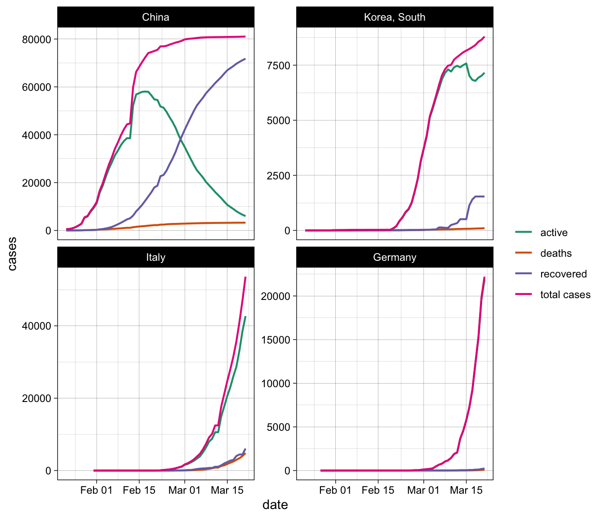
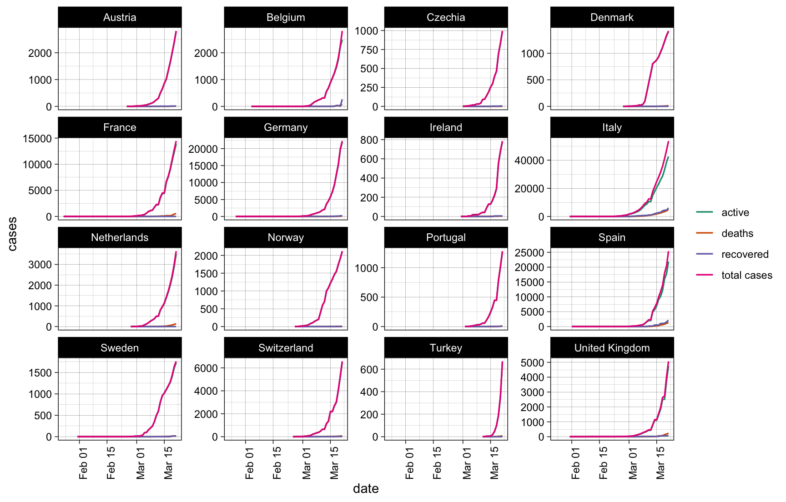
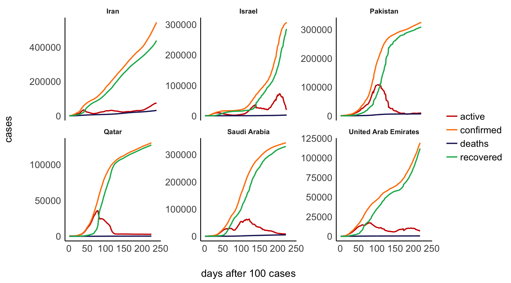

# Visualizing the Corona (COVID-19) pandemic

## Basic idea

I generally think that the news do a good job in describing and
visualizing the corona pandemic. However, there are two things that I
believe are quite problematic and that I am missing the any news
coverage on the pandemic.

1.  Visualizations of the growth curves often log-transform the x-axis
    instead of showing the actual *exponential* growth.
2.  Visualizations almost never plot *total* cases against a) deaths, b)
    recovered, AND c) active cases.

With regard to the former, I recently wrote [this
blogpost](http://philippmasur.de/blog/2020/03/13/understanding-exponential-growth-the-corona-pandemic/)
that explains why exponential growth is so hard to grasp. With regard to
the latter, I believe that showing only the total cases growth curve can
be misleading or at least is not sufficient to understand the pandemic
and to try to judge whether certain measures work or not. From my point
of view, these visualizations would become a bit more informative, if we
also look at the active cases vs. recovered cases vs. deaths. Looking at
all *four* curves simultaneously, we can at least partly see how well a
country succeeds in stopping the infections (BUT: see disclaimer further
below\!)

In what follows, I am using actual data on worldwide total infections,
death rates, and number of recoveries to produce these more insightful
visualizations.

### Where does the data come frome?

The analyses and visualizations are based on the data provided by the
John Hopkins University in the [Official 2019 Novel Coronavirus COVID-19
(2019-nCoV) Data
Repository](https://github.com/CSSEGISandData/COVID-19). The same data
sets are used to constantly update this visual dashboard:
<https://coronavirus.jhu.edu/map.html>

**IMPORTANT DISCLAIMER:** Although I do believe that these data and
visualization help us to understand the pandemic, they are nonetheless
flawed\! When we want to make sense of positive test results (i.e.,
total cases and in the long run then mortality rates and recovering
processes), we need to know how many tests were conducted. For example,
Italy has an unusually high mortality rate at this moment (\~8%).
However, Italy ran only \~150k tests, thus the real rate of infections
is probably much higher, implying a lower mortality rate. South Korea,
in contrast, has tested more than 270,000 people, which amounts to more
than 5200 tests per million inhabitants — more than any other country\!
A high diagnostic capacity at scale is hence key to epidemic control as
it provides us with precise estimates and growth rate predictions. For
more information, see [this
article](https://www.sciencemag.org/news/2020/03/coronavirus-cases-have-dropped-sharply-south-korea-whats-secret-its-success?fbclid=IwAR3BnhqQMxCdu8-fQelEkWIDQn-j9UASV773Xl-WbIy8l7M5ZVSQpHFgkL8)
in Science. For this reasons, I believe that the value of these
visualization lies not in the actual numbers, but in the patterns that
emerge by comparing all four curves.

### Will these figures be updated?

Yes, I will update these figures every morning. The last update was made
on 2020-03-21 09:18:03. The data of the John Hopkins University,
however, is always updated at 23:59. What you see is hence the situation
on 2020-03-20 at 23:59.

## The analyses

The following code downloads the data sets and transforms them directly
to be ready for the visualizations. Overall, the data is already in a
very tidy format. As I am not focusing on provinces, we only summarize
the cases across countries and dates (NOT provinces). That said, I
distinguish China and Hong Kong due to their different timelines in
responding to the virus outbreak.

``` r
library(tidyverse)
library(readr)

# Function to crawl data from the github repository
get_data <- function(url) {
  read_csv(url(url)) %>%
  select(-Lat, -Long) %>%
  rename(province = "Province/State",
         country = "Country/Region") %>%
  gather(date, type, -country, -province) %>%
  mutate(type = as.numeric(type),
         date = lubridate::mdy(date)) %>% 
  tbl_df
}

# Get total cases per country/region
cases <- "https://raw.githubusercontent.com/CSSEGISandData/COVID-19/master/csse_covid_19_data/csse_covid_19_time_series/time_series_19-covid-Confirmed.csv" 

# Get number of deaths per country/region
deaths <- "https://raw.githubusercontent.com/CSSEGISandData/COVID-19/master/csse_covid_19_data/csse_covid_19_time_series/time_series_19-covid-Deaths.csv" 

# Get number of recovered cases per country/region
recovered <- "https://raw.githubusercontent.com/CSSEGISandData/COVID-19/master/csse_covid_19_data/csse_covid_19_time_series/time_series_19-covid-Recovered.csv" 

# Prepare data
d_cases <- get_data(cases) %>%
  rename(cases = type)
d_deaths <- get_data(deaths) %>%
  rename(deaths = type)
d_recovered <- get_data(recovered) %>%
  rename(recovered = type)

# Join data sets by country, province, and date
d <- d_cases %>%
  left_join(d_deaths) %>%
  left_join(d_recovered) 

# Distinguish Hong Kong and China
d$country[d$province=="Hong Kong"] <- "Hong Kong"

# Prepare data for visualization
data <- d %>%
  group_by(country, date) %>%
  summarize(cases = sum(cases),
            deaths = sum(deaths),
            recovered = sum(recovered)) %>%
  filter(country != "") %>%
  mutate(active = cases - (deaths + recovered)) %>%
  magrittr::set_colnames(c("country", "date", "total cases", "deaths", "recovered", "active")) %>%
  ungroup
```

### 1\. Analyzing China, South Korea, Italy, and Germany

In a first step, I am comparing China, South Korea, Italy, and Germany.
Why these four countries? These four countries are at different stages
during the corona pandemic. China was the first to experience the
outbreak and they have almost contained the spreading of the virus by
now. South Korea is close to containing the virus. Italy is experiencing
the second worst pandemic after China and drastic measures have been
taken. The virus has reached Germany considerably later, but the growth
rate is very steep. By comparing these countries, we can learn a lot
about “typical” growth rates and patterns.

``` r
# Current cases 
table <- data %>%
  filter(date == as.character(Sys.Date()-1)) %>%
  filter(country == "China" | country == "Germany" | 
         country == "Italy" | country == "Korea, South") %>%
  arrange(desc(`total cases`))
papaja::apa_table(table, format = "html", digits = 0, align = c("l", "c", rep("r", 4)))
```

<caption>

(\#tab:unnamed-chunk-2)

</caption>

<caption>

\*\*

</caption>

| country      |    date    | total cases | deaths | recovered | active |
| :----------- | :--------: | ----------: | -----: | --------: | -----: |
| China        | 2020-03-20 |      80,994 |  3,249 |    71,168 |  6,577 |
| Italy        | 2020-03-20 |      47,021 |  4,032 |     4,440 | 38,549 |
| Germany      | 2020-03-20 |      19,848 |     67 |       180 | 19,601 |
| Korea, South | 2020-03-20 |       8,652 |     94 |     1,540 |  7,018 |

``` r
# Example plot for China, Germany, Italy and South Korea
data %>%
  filter(`total cases` >= 1) %>%
  filter(country == "China" | country == "Germany" | 
         country == "Italy" | country == "Korea, South") %>%
  mutate(country = factor(country, 
                          levels = c("China", "Korea, South", 
                                     "Italy", "Germany"))) %>%
  gather(key, value, -country, -date) %>%
  ggplot(aes(x = date, y = value, color = key)) +
  geom_line() +
  scale_color_brewer(palette = "Set2") +
  facet_wrap(~country, scale = "free_y") +
  theme_bw() +
  labs(x = "date", y = "cases", color = "")
```



``` r

ggsave("figures/plot_1.png",
       width = 8,
       height = 7)
```

CHINA (upper left): The number of *total* confirmed cases is still
rising (pink), but only very slowly and almost comes to a halt. But, the
number of *active* cases (green) is declining steeply and at the same
time the number of *recovered* cases (blue) is increasing a lot, slowly
approximating the number of *total* cases. This is how it should look
like as this pattern shows that measures are working and the spreading
of the virus is stopping.

SOUTH KOREA (upper right): The number of *total* confirmed cases is
still rising (pink), but the growth rate slowly resembles a S-curve.
This is a good sign, because new infections are fewer. The number of
*active* cases (green) is hence starting to decline (since the 15th of
March) and at the same time the number of *recovered* cases (blue) is
starting to grow.

ITALY (lower left): the number of *total* confirmed cases is growing
exponentially. More importantly, the number of *active* cases is almost
equivalent to the number of *total* cases (hopefully the slight
deviation from the exponential trend will prove to be real). The number
of *recovered* cases sadly equals the number of *deaths*. So far, we do
not see implications of the drastic measures taken by the Italian
government. Yet, recent analyses of the number of *total* cases suggest
the curve is slowly declining (which would be a sign of hope\!).

GERMANY (lower right): The number of *total* confirmed cases likewise
grows exponentially. Again (see Italy), the number of *active* cases is
practically equivalent to the number of *total* cases (so far, luckily
only few *deaths*, but also only few recovered).

**Conclusion:** As long as we do not see signs that the curves approach
a similar pattern as in China, the virus is still spreading
uncontrollably.

### 2\. Development in countries that reacted fast

Although the number of cases in these countries is small (a good
thing\!), we should look at the distributions of countries that reacted
faster (e.g., Hong Kong, Taiwan, Singapore).

``` r
# Current cases 
table2 <- data %>%
  filter(date == as.character(Sys.Date()-1)) %>%
  filter(country == "Hong Kong" | 
         country == "Taiwan*" | 
         country == "Singapore") %>%
  arrange(desc(`total cases`))
papaja::apa_table(table2, format = "html", digits = 0, align = c("l", "c", rep("r", 4)))
```

<caption>

(\#tab:unnamed-chunk-3)

</caption>

<caption>

\*\*

</caption>

| country   |    date    | total cases | deaths | recovered | active |
| :-------- | :--------: | ----------: | -----: | --------: | -----: |
| Singapore | 2020-03-20 |         385 |      0 |       124 |    261 |
| Hong Kong | 2020-03-20 |         256 |      4 |        98 |    154 |
| Taiwan\*  | 2020-03-20 |         135 |      2 |        26 |    107 |

``` r
# Plot for Hong Kong, Taiwan, and Singapore 
data %>%
  filter(`total cases` >= 1) %>%
  filter(country == "Hong Kong" | 
         country == "Taiwan*" | 
         country == "Singapore") %>%
  gather(key, value, -country, -date) %>%
  ggplot(aes(x = date, y = value, color = key)) +
  geom_line() +
  facet_wrap(~country, scales = "free_y") +
  theme_bw() +
  scale_color_brewer(palette = "Set2") +
  labs(x = "date", y = "cases", color = "")
```


``` r

ggsave("figures/plot_2.png",
       width = 8,
       height = 3)
```

We clearly see that the number of *active* cases is declining earlier.
At the same time the number of *total* cases increases, but not
exponentially\!

### 3\. Worldwide developments

#### The situation in Europe

A comparative plot of all countries with more than 500 confirmed total
cases.

``` r
europe <- c("Italy", "Spain", "Germany", "France", 
            "Switzerland", "United Kingdom", "Netherlands", 
            "Norway", "Austria", "Sweden", "Belgium", "Denmark")

# Current cases 
table3 <- data %>%
  filter(date == as.character(Sys.Date()-1)) %>%
  filter(country %in% europe) %>%
  arrange(desc(`total cases`))
papaja::apa_table(table3, format = "html", digits = 0, align = c("l", "c", rep("r", 4)))
```

<caption>

(\#tab:unnamed-chunk-4)

</caption>

<caption>

\*\*

</caption>

| country        |    date    | total cases | deaths | recovered | active |
| :------------- | :--------: | ----------: | -----: | --------: | -----: |
| Italy          | 2020-03-20 |      47,021 |  4,032 |     4,440 | 38,549 |
| Spain          | 2020-03-20 |      20,410 |  1,043 |     1,588 | 17,779 |
| Germany        | 2020-03-20 |      19,848 |     67 |       180 | 19,601 |
| France         | 2020-03-20 |      12,726 |    450 |        12 | 12,264 |
| Switzerland    | 2020-03-20 |       5,294 |     54 |        15 |  5,225 |
| United Kingdom | 2020-03-20 |       4,014 |    178 |        67 |  3,769 |
| Netherlands    | 2020-03-20 |       3,003 |    107 |         2 |  2,894 |
| Austria        | 2020-03-20 |       2,388 |      6 |         9 |  2,373 |
| Belgium        | 2020-03-20 |       2,257 |     37 |         1 |  2,219 |
| Norway         | 2020-03-20 |       1,914 |      7 |         1 |  1,906 |
| Sweden         | 2020-03-20 |       1,639 |     16 |        16 |  1,607 |
| Denmark        | 2020-03-20 |       1,337 |      9 |         1 |  1,327 |

``` r
data %>%
  filter(`total cases` >= 1) %>%
  filter(country %in% europe) %>%
  gather(key, value, -country, -date) %>%
  ggplot(aes(x = date, y = value, color = key)) +
  geom_line() +
  facet_wrap(~country, scales = "free_y") +
  theme_bw() +
  scale_color_brewer(palette = "Set2") +
  labs(x = "date", y = "cases", color = "")
```



``` r

ggsave("figures/plot_3.png",
       width = 10,
       height = 6)
```

#### USA and Canada

``` r
# Current cases 
table4 <- data %>%
  filter(date == as.character(Sys.Date()-1)) %>%
  filter(country == "US" | country == "Canada") %>%
  arrange(desc(`total cases`))
papaja::apa_table(table4, format = "html", digits = 0, align = c("l", "c", rep("r", 4)))
```

<caption>

(\#tab:unnamed-chunk-5)

</caption>

<caption>

\*\*

</caption>

| country |    date    | total cases | deaths | recovered | active |
| :------ | :--------: | ----------: | -----: | --------: | -----: |
| US      | 2020-03-20 |      19,100 |    244 |         0 | 18,856 |
| Canada  | 2020-03-20 |         943 |     12 |         9 |    922 |

``` r
data %>%
  filter(`total cases` >= 1) %>%
  filter(country == "US" | country == "Canada") %>%
  gather(key, value, -country, -date) %>%
  ggplot(aes(x = date, y = value, color = key)) +
  geom_line() +
  facet_wrap(~country, scales = "free_y") +
  theme_bw() +
  scale_color_brewer(palette = "Set2") +
  labs(x = "date", y = "cases", color = "")
```


``` r

ggsave("figures/plot_4.png",
       width = 7,
       height = 3)
```

#### Middle East

``` r
# Current cases 
table5 <- data %>%
  filter(date == as.character(Sys.Date()-1)) %>%
  filter(country %in% c("Iran", "Qatar", 
                        "Israel", "Pakistan")) %>%
  arrange(desc(`total cases`))
papaja::apa_table(table5, format = "html", digits = 0, align = c("l", "c", rep("r", 4)))
```

<caption>

(\#tab:unnamed-chunk-6)

</caption>

<caption>

\*\*

</caption>

| country  |    date    | total cases | deaths | recovered | active |
| :------- | :--------: | ----------: | -----: | --------: | -----: |
| Iran     | 2020-03-20 |      19,644 |  1,433 |     6,745 | 11,466 |
| Israel   | 2020-03-20 |         705 |      0 |        14 |    691 |
| Pakistan | 2020-03-20 |         501 |      3 |        13 |    485 |
| Qatar    | 2020-03-20 |         470 |      0 |        10 |    460 |

``` r
data %>%
  filter(country %in% c("Iran", "Qatar", 
                        "Israel", "Pakistan")) %>%
  gather(key, value, -country, -date) %>%
  ggplot(aes(x = date, y = value, color = key)) +
  geom_line() +
  facet_wrap(~country, scales = "free_y") +
  theme_bw() +
  scale_color_brewer(palette = "Set2") +
  labs(x = "date", y = "cases", color = "")
```



``` r

ggsave("figures/plot_5.png",
       width = 8,
       height = 7)
```

#### Asia

Plot for Asian countries with \> 500 cases.

``` r
# Current cases 
table6 <- data %>%
  filter(date == as.character(Sys.Date()-1)) %>%
  filter(country %in% c("China", "Korea, South", "Japan", "Malaysia")) %>%
  arrange(desc(`total cases`))
papaja::apa_table(table6, format = "html", digits = 0, align = c("l", "c", rep("r", 4)))
```

<caption>

(\#tab:unnamed-chunk-7)

</caption>

<caption>

\*\*

</caption>

| country      |    date    | total cases | deaths | recovered | active |
| :----------- | :--------: | ----------: | -----: | --------: | -----: |
| China        | 2020-03-20 |      80,994 |  3,249 |    71,168 |  6,577 |
| Korea, South | 2020-03-20 |       8,652 |     94 |     1,540 |  7,018 |
| Malaysia     | 2020-03-20 |       1,030 |      3 |        87 |    940 |
| Japan        | 2020-03-20 |         963 |     33 |       191 |    739 |

``` r
data %>%
  filter(country %in% c("China", "Korea, South", "Japan", "Malaysia")) %>%
  gather(key, value, -country, -date) %>%
  ggplot(aes(x = date, y = value, color = key)) +
  geom_line() +
  facet_wrap(~country, scales = "free_y") +
  theme_bw() +
  scale_color_brewer(palette = "Set2") +
  labs(x = "date", y = "cases", color = "")
```


``` r

ggsave("figures/plot_6.png",
       width = 8,
       height = 7)
```

Let me know if I should include any other countries in on this page.
