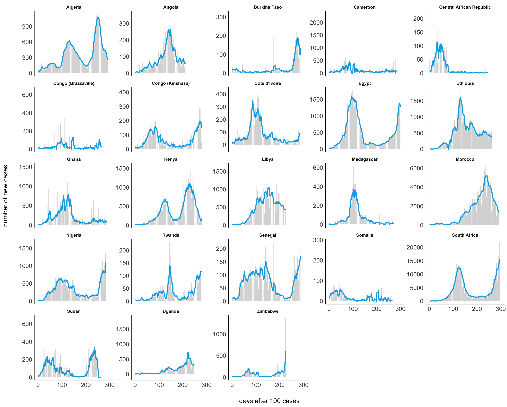

# Visualizing the Corona (COVID-19) pandemic

#### Where does the data come frome?

The analyses and visualizations are based on the data provided by the
John Hopkins University in the [Official 2019 Novel Coronavirus COVID-19
(2019-nCoV) Data
Repository](https://github.com/CSSEGISandData/COVID-19). The same data
sets are used to constantly update this visual dashboard:
<https://coronavirus.jhu.edu/map.html>

**IMPORTANT DISCLAIMER:** Although I do believe that these data help us
to understand the pandemic, they are nonetheless very imprecise. When we
want to make sense of positive test results (i.e., total cases and in
the long run mortality rates and recovering processes), we need to know
how many tests were conducted (for more information on this, see [this
article](https://www.sciencemag.org/news/2020/03/coronavirus-cases-have-dropped-sharply-south-korea-whats-secret-its-success?fbclid=IwAR3BnhqQMxCdu8-fQelEkWIDQn-j9UASV773Xl-WbIy8l7M5ZVSQpHFgkL8)
in Science).

Furthermore, I would like to emphasize that I am not an expert on
epidemology or virus outbreaks and I am not working in the health
sector. On this page, I am only visualizing the data by the John Hopkins
University. Reliance on the these visualizations for medical guidance or
use of these visualization in commerce is strictly prohibited.

#### Will these figures be updated?

The last update was made on 2020-11-13 10:41:21. The data of the John
Hopkins University, however, are always updated at 23:59. What you see
is hence the situation on 2020-11-12 at 23:59:00. Also bear in mind that
the reporting of cases is somewhat delayed so that it is very likely
that the actual numbers are higher.

## Visualizations

If you are interested in the R code, please see the
[README.rmd](https://github.com/masurp/corona_analyses/blob/master/README.rmd).

### 1\. Examplary patterns

<caption>

(\#tab:unnamed-chunk-2)

</caption>

\*\*

| country        |    date    |     confirmed |     deaths |    recovered |       active | new\_cases |
| :------------- | :--------: | ------------: | ---------: | -----------: | -----------: | ---------: |
| US             | 2020-11-12 | 10,552,821.00 | 242,423.00 | 4,051,256.00 | 6,259,142.00 | 153,496.00 |
| India          | 2020-11-12 |  8,728,795.00 | 128,668.00 | 8,115,580.00 |   484,547.00 |  44,879.00 |
| France         | 2020-11-12 |  1,915,282.00 |  42,599.00 |   139,212.00 | 1,733,471.00 |     364.00 |
| Russia         | 2020-11-12 |  1,843,678.00 |  31,755.00 | 1,378,463.00 |   433,460.00 |  21,333.00 |
| Spain          | 2020-11-12 |  1,437,220.00 |  40,461.00 |   150,376.00 | 1,246,383.00 |  19,511.00 |
| United Kingdom | 2020-11-12 |  1,293,715.00 |  51,020.00 |     3,031.00 | 1,239,664.00 |  33,517.00 |
| Italy          | 2020-11-12 |  1,066,401.00 |  43,589.00 |   387,758.00 |   635,054.00 |  37,977.00 |
| Germany        | 2020-11-12 |    762,832.00 |  12,216.00 |   474,208.00 |   276,408.00 |  24,738.00 |
| Netherlands    | 2020-11-12 |    437,376.00 |   8,375.00 |     6,372.00 |   422,629.00 |   5,680.00 |

### 2\. Comparing visualizations

### Total cases

One thing that is constantly debatted is how to visualize the growth of
total confirmed cases at all. Log-transform the y-axis or not? Plot
against the date? Plot against days after 100th case? Plot something
entirely different?

Here, I would like to explain some differences between visualizations
that have been used in the media or on Twitter. All of them are helpful
in their own regard.

1.  LEFT: Here, I plotted total cases against days after the 100th cases
    *without* logarithmizing the y-axis.

2.  MIDDLE: The y-axis is logarithmized. This figure is often shown in
    the news.

3.  RIGHT: New cases per 7 days (y-axis) are plotted against total cases
    (x-axis), both axes are logarithmized (Idea explained in this
    [video](https://www.youtube.com/watch?v=54XLXg4fYsc)).

*Note:* Green = USA, Blue = Italy, Red = Germany, Pink = Austria, Orange
= United Kingdom

#### Daily new cases

Another visualization that is often used is based on changes in daily
new cases (here averaged cross one or two weeks).

##### Europe

##### America

##### Middle East

##### Asia

##### Africa

