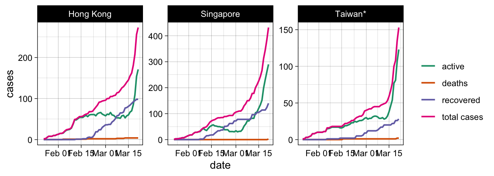

# Visualizing the Corona (COVID-19) pandemic

## Basic idea

I generally think that the news do a good job in describing and
visualizing the corona pandemic. However, there are two things that I
believe are quite problematic and that I am missing the any news
coverage on the pandemic.

1.  Visualizations of the growth curves often log-transform the x-axis
    instead of showing the actual *exponential* growth.
2.  Visualizations almost never plot *total* cases against a) deaths, b)
    recovered, AND c) active cases.

With regard to the former, I recently wrote [this
blogpost](http://philippmasur.de/blog/2020/03/13/understanding-exponential-growth-the-corona-pandemic/)
that explains why exponential growth is so hard to grasp. With regard to
the latter, I believe that showing only the total cases can be
misleading or at least is not sufficient to understand the pandemic.
From my point of view, visualizations of the growth cuvres would become
a bit more informative if we plot total cases, active cases, recovered
cases, and deaths. If we plot all *four* curves simultaneously, patterns
emerge that tell us something about the phase that a country is it. We
may even see how well a country succeeds in stopping the infections
(BUT: see disclaimer further below\!). In what follows, I am using
actual data on worldwide total infections, death rates, and number of
recoveries to produce these more insightful visualizations.

#### Where does the data come frome?

The analyses and visualizations are based on the data provided by the
John Hopkins University in the [Official 2019 Novel Coronavirus COVID-19
(2019-nCoV) Data
Repository](https://github.com/CSSEGISandData/COVID-19). The same data
sets are used to constantly update this visual dashboard:
<https://coronavirus.jhu.edu/map.html>

**IMPORTANT DISCLAIMER:** Although I do believe that these data help us
to understand the pandemic, they are nonetheless very imprecise. When we
want to make sense of positive test results (i.e., total cases and in
the long run mortality rates and recovering processes), we need to know
how many tests were conducted. For example, Italy has an unusually high
mortality rate at this moment (\~8%). However, Italy ran only \~150k
tests. The real rate of infections is probably much higher, implying a
lower mortality rate. South Korea, in contrast, has tested \> 270,000
people, which amounts to more than 5,200 tests per million inhabitants —
more tests than any other country\! A high diagnostic capacity at scale
is hence key to epidemic control as it provides us with precise
estimates and growth rate predictions (for more information on this, see
[this
article](https://www.sciencemag.org/news/2020/03/coronavirus-cases-have-dropped-sharply-south-korea-whats-secret-its-success?fbclid=IwAR3BnhqQMxCdu8-fQelEkWIDQn-j9UASV773Xl-WbIy8l7M5ZVSQpHFgkL8)
in Science). For this reasons, I believe that the value of these
visualization lies not in comparing the actual numbers, but in the
understanding the patterns that emerge by comparing all four curves.

#### Will these figures be updated?

Yes, I will update these figures every morning. The last update was made
on 2020-03-22 16:58:53. The data of the John Hopkins University,
however, are always updated at 23:59. What you see is hence the
situation on 2020-03-21 at 23:59:00. Also bear in mind that the
reporting of cases is somewhat delayed so that it is very likely that
the actual numbers are higher.

## Visualizations

Note: I am not focusing on provinces, I hence only summarize across
countries and dates. That said, I distinguish China and Hong Kong due to
their different timelines in responding to the virus outbreak.

If you are interested in the R code, please see the
[README.rmd](https://github.com/masurp/corona_analyses/blob/master/README.rmd).

### 1\. Analyzing China, South Korea, Italy, and Germany

In a first step, I am comparing China, South Korea, Italy, and Germany.
Why these countries? These four countries are at different stages. China
was the first to experience the outbreak and they have almost contained
the spreading of the virus by now. South Korea is starting to control
the virus outbreak. Italy is currently experiencing one of the worst
outbreaks and drastic measures have been taken in the last weeks. The
virus has reached Germany considerably later, but the growth rate is
very steep at this moment. By comparing these countries, we can learn a
lot about “typical” patterns between the four curves.

<caption>

(\#tab:example)

</caption>

<caption>

\*\*

</caption>

| country      |    date    | total cases | deaths | recovered | active |
| :----------- | :--------: | ----------: | -----: | --------: | -----: |
| China        | 2020-03-21 |      81,032 |  3,255 |    71,759 |  6,018 |
| Italy        | 2020-03-21 |      53,578 |  4,825 |     6,072 | 42,681 |
| Germany      | 2020-03-21 |      22,213 |     84 |       233 | 21,896 |
| Korea, South | 2020-03-21 |       8,799 |    102 |     1,540 |  7,157 |

CHINA (upper left): The number of *total* confirmed cases is still
rising (pink), but only very slowly and almost comes to a halt. The
number of *active* cases (green) is declining steeply and at the same
time the number of *recovered* cases (blue) is increasing a lot, slowly
approximating the number of *total* cases. This is how it should look
like as this pattern shows that measures are working and the spreading
of the virus is stopping.

SOUTH KOREA (upper right): The number of *total* confirmed cases is
still rising (pink), but the growth rate slowly resembles an S-curve.
This is a good sign, because new infections are fewer. The number of
*active* cases (green) is hence starting to decline (although it
recently started to grow again) and at the same time the number of
*recovered* cases (blue) is starting to grow.

ITALY (lower left): The number of *total* confirmed cases is still
growing exponentially. More importantly, the number of *active* cases is
almost equivalent to the number of *total* cases. The number of
*recovered* cases sadly equals the number of *deaths*. So far, we do not
see implications of the drastic measures taken by the Italian
government.

GERMANY (lower right): The number of *total* confirmed cases likewise
grows exponentially. Again, the number of *active* cases is practically
equivalent to the number of *total* cases.

**Conclusion:** As long as we do not see signs that the curves approach
a similar pattern as in China, the virus is still spreading
uncontrollably.

### 2\. Development in countries that reacted fast

Although the number of cases in these countries is small (a good
thing\!), we should look at the distributions of countries that reacted
faster (e.g., Hong Kong, Taiwan, Singapore).

<caption>

(\#tab:fastcountries)

</caption>

<caption>

\*\*

</caption>

| country   |    date    | total cases | deaths | recovered | active |
| :-------- | :--------: | ----------: | -----: | --------: | -----: |
| Singapore | 2020-03-21 |         432 |      2 |       140 |    290 |
| Hong Kong | 2020-03-21 |         273 |      4 |        98 |    171 |
| Taiwan\*  | 2020-03-21 |         153 |      2 |        28 |    123 |

We clearly see that the number of *active* cases is declining earlier.
At the same time the number of *total* cases increases, but not
exponentially.

### 3\. Worldwide developments

#### The situation in Europe

A comparative plot of all countries with more than \~500 confirmed total
cases.

<caption>

(\#tab:europe)

</caption>

<caption>

\*\*

</caption>

| country        |    date    | total cases | deaths | recovered | active |
| :------------- | :--------: | ----------: | -----: | --------: | -----: |
| Italy          | 2020-03-21 |      53,578 |  4,825 |     6,072 | 42,681 |
| Spain          | 2020-03-21 |      25,374 |  1,375 |     2,125 | 21,874 |
| Germany        | 2020-03-21 |      22,213 |     84 |       233 | 21,896 |
| France         | 2020-03-21 |      14,431 |    562 |        12 | 13,857 |
| Switzerland    | 2020-03-21 |       6,575 |     75 |        15 |  6,485 |
| United Kingdom | 2020-03-21 |       5,067 |    234 |        67 |  4,766 |
| Netherlands    | 2020-03-21 |       3,640 |    137 |         2 |  3,501 |
| Belgium        | 2020-03-21 |       2,815 |     67 |       263 |  2,485 |
| Austria        | 2020-03-21 |       2,814 |      8 |         9 |  2,797 |
| Norway         | 2020-03-21 |       2,118 |      7 |         1 |  2,110 |
| Sweden         | 2020-03-21 |       1,763 |     20 |        16 |  1,727 |
| Denmark        | 2020-03-21 |       1,420 |     13 |         1 |  1,406 |
| Portugal       | 2020-03-21 |       1,280 |     12 |         5 |  1,263 |
| Czechia        | 2020-03-21 |         995 |      0 |         6 |    989 |
| Ireland        | 2020-03-21 |         785 |      3 |         5 |    777 |
| Turkey         | 2020-03-21 |         670 |      9 |         0 |    661 |

#### North, Middle and South America

<caption>

(\#tab:unnamed-chunk-3)

</caption>

<caption>

\*\*

</caption>

| country |    date    | total cases | deaths | recovered | active |
| :------ | :--------: | ----------: | -----: | --------: | -----: |
| US      | 2020-03-21 |      25,489 |    307 |         0 | 25,182 |
| Canada  | 2020-03-21 |       1,278 |     19 |        10 |  1,249 |
| Brazil  | 2020-03-21 |       1,021 |     15 |         2 |  1,004 |

#### Middle East

Plot for countries in the middle east with \> 400 cases.

<caption>

(\#tab:unnamed-chunk-4)

</caption>

<caption>

\*\*

</caption>

| country  |    date    | total cases | deaths | recovered | active |
| :------- | :--------: | ----------: | -----: | --------: | -----: |
| Iran     | 2020-03-21 |      20,610 |  1,556 |     7,635 | 11,419 |
| Israel   | 2020-03-21 |         883 |      1 |        36 |    846 |
| Pakistan | 2020-03-21 |         730 |      3 |        13 |    714 |
| Qatar    | 2020-03-21 |         481 |      0 |        27 |    454 |

#### Asia

Plot for Asian countries with \> 500 cases.

<caption>

(\#tab:unnamed-chunk-5)

</caption>

<caption>

\*\*

</caption>

| country      |    date    | total cases | deaths | recovered | active |
| :----------- | :--------: | ----------: | -----: | --------: | -----: |
| China        | 2020-03-21 |      81,032 |  3,255 |    71,759 |  6,018 |
| Korea, South | 2020-03-21 |       8,799 |    102 |     1,540 |  7,157 |
| Malaysia     | 2020-03-21 |       1,183 |      4 |       114 |  1,065 |
| Japan        | 2020-03-21 |       1,007 |     35 |       232 |    740 |

Let me know if I should include any other countries in on this page.
