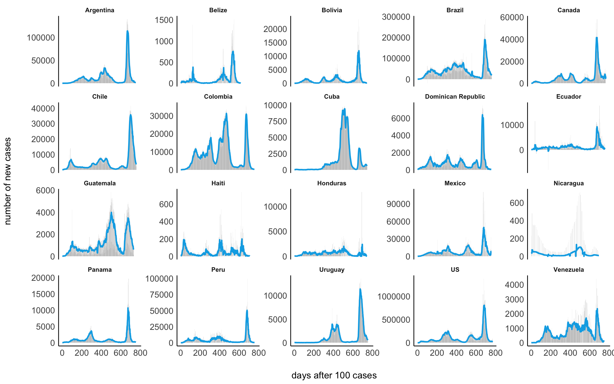
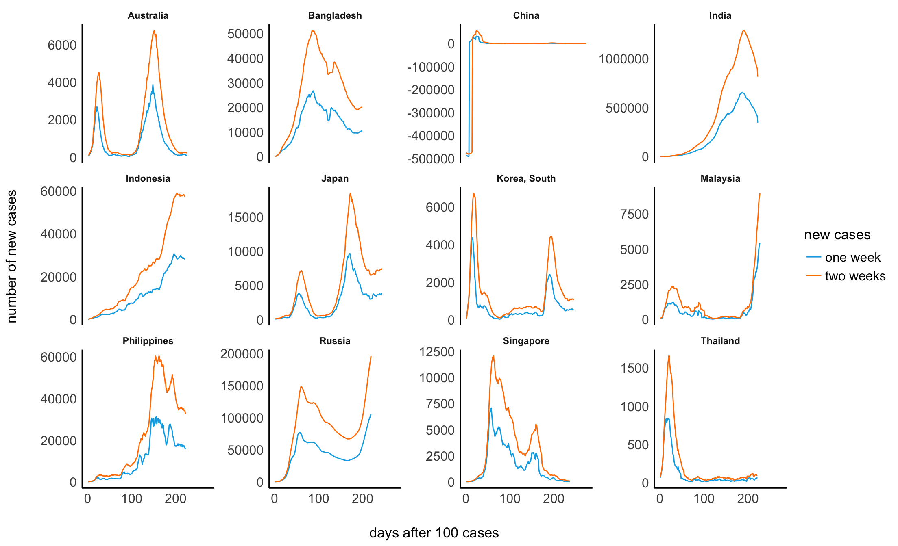
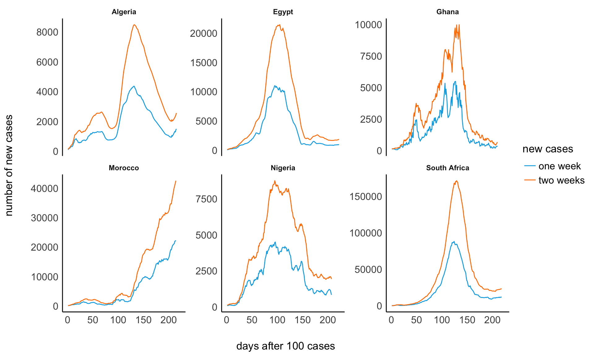

# Visualizing the Corona (COVID-19) pandemic

## Basic idea

I generally think that the news do a good job in describing and
visualizing the corona pandemic. However, there are two things that I
believe are quite problematic and that I am missing the any news
coverage on the pandemic.

1.  Visualizations of the growth curves often log-transform the x-axis
    instead of showing or at least comparing it with the actual
    *exponential* growth.
2.  Visualizations almost never plot *total* cases against a) deaths, b)
    recovered, AND c) active cases.

With regard to the former, I recently wrote [this
blogpost](http://philippmasur.de/blog/2020/03/13/understanding-exponential-growth-the-corona-pandemic/)
that explains why exponential growth is so hard to grasp. With regard to
the latter, I believe that visualizations would become a bit more
informative if we plot total cases, active cases, recovered cases, and
deaths. If we plot all *four* curves simultaneously, patterns emerge
that might tell us something about the “phase”" that a country is it. We
may also see whether a country succeeds in stopping the infections (BUT:
see disclaimer further below\!). In what follows, I am using the data on
worldwide total infections, death rates, and number of recoveries to
produce these (potentially) a bit more insightful visualizations.

#### Where does the data come frome?

The analyses and visualizations are based on the data provided by the
John Hopkins University in the [Official 2019 Novel Coronavirus COVID-19
(2019-nCoV) Data
Repository](https://github.com/CSSEGISandData/COVID-19). The same data
sets are used to constantly update this visual dashboard:
<https://coronavirus.jhu.edu/map.html>

**IMPORTANT DISCLAIMER:** Although I do believe that these data help us
to understand the pandemic, they are nonetheless very imprecise. When we
want to make sense of positive test results (i.e., total cases and in
the long run mortality rates and recovering processes), we need to know
how many tests were conducted. South Korea, for example, has tested \>
270,000 people, which amounts to more than 5,200 tests per million
inhabitants. The numbers in South Korea are hence more trustworthy than
the numbers of all other countries. A high diagnostic capacity at scale
is hence key to epidemic control as it provides us with precise
estimates and growth rate predictions (for more information on this, see
[this
article](https://www.sciencemag.org/news/2020/03/coronavirus-cases-have-dropped-sharply-south-korea-whats-secret-its-success?fbclid=IwAR3BnhqQMxCdu8-fQelEkWIDQn-j9UASV773Xl-WbIy8l7M5ZVSQpHFgkL8)
in Science). For this reasons, I believe that the value of these
visualization lies NOT in comparing the actual numbers, but in
understanding the patterns that emerge by comparing all four curves.

Furthermore, I would like to emphasize that I am not an expert on
epidemology or virus outbreaks and I am not working in the health
sector. On this page, I am only visualizing the data by the John Hopkins
University in a different way that most news or other outlets do.
Reliance on the these visualizations for medical guidance or use of
these visualization in commerce is strictly prohibited.

#### Will these figures be updated?

The last update was made on 2020-07-16 09:47:25. The data of the John
Hopkins University, however, are always updated at 23:59. What you see
is hence the situation on 2020-07-15 at 23:59:00. Also bear in mind that
the reporting of cases is somewhat delayed so that it is very likely
that the actual numbers are higher.

## Visualizations

If you are interested in the R code, please see the
[README.rmd](https://github.com/masurp/corona_analyses/blob/master/README.rmd).

### 1\. Examplary patterns

<caption>

(\#tab:unnamed-chunk-2)

</caption>

\*\*

| country        |    date    |    confirmed |     deaths |    recovered |       active | new\_cases |
| :------------- | :--------: | -----------: | ---------: | -----------: | -----------: | ---------: |
| US             | 2020-07-15 | 3,497,847.00 | 137,407.00 | 1,075,882.00 | 2,284,558.00 |  66,273.00 |
| Brazil         | 2020-07-15 | 1,966,748.00 |  75,366.00 | 1,350,098.00 |   541,284.00 |  39,924.00 |
| India          | 2020-07-15 |   968,857.00 |  24,914.00 |   612,768.00 |   331,175.00 |  32,676.00 |
| Russia         | 2020-07-15 |   745,197.00 |  11,753.00 |   522,375.00 |   211,069.00 |   6,410.00 |
| United Kingdom | 2020-07-15 |   293,469.00 |  45,138.00 |     1,386.00 |   246,945.00 |     538.00 |
| Spain          | 2020-07-15 |   257,494.00 |  28,413.00 |   150,376.00 |    78,705.00 |     875.00 |
| Italy          | 2020-07-15 |   243,506.00 |  34,997.00 |   196,016.00 |    12,493.00 |     162.00 |
| Germany        | 2020-07-15 |   200,890.00 |   9,080.00 |   186,000.00 |     5,810.00 |     434.00 |
| China          | 2020-07-15 |    85,246.00 |   4,644.00 |    80,005.00 |       597.00 |      20.00 |

### 2\. Worldwide developments

#### Europe

#### North, Middle and South America

#### Middle East

#### Asia, Indonesia, Australia

#### Africa

### 3\. Alternative visualizations

### Total cases

One thing that is constantly debatted is how to visualize the growth of
total confirmed cases at all. Log-transform the y-axis or not? Plot
against the date? Plot against days after 100th case? Plot something
entirely different?

Here, I would like to explain some differences between visualizations
that have been used in the media or on Twitter. All of them are helpful
in their own regard.

1.  LEFT: Here, I plotted total cases against days after the 100th cases
    *without* logarithmizing the y-axis.

2.  MIDDLE: The y-axis is logarithmized. This figure is often shown in
    the news.

3.  RIGHT: New cases per 7 days (y-axis) are plotted against total cases
    (x-axis), both axes are logarithmized (Idea explained in this
    [video](https://www.youtube.com/watch?v=54XLXg4fYsc)).

We see clearly that each plot has benefits and weaknesses. The first
example provides perhaps the best comparison of the total numbers and
shows quite drastically how exponential growth curves look likes (bear
in mind that I cut off the growth curve of the US, which actually
extends to more than 1,5 million cases. I did this to make the other
growth curves visible). S-curves represent positive developments towards
a slower growth. Yet, changes are barely identifiable.

The second example makes the actual growth more comparable and by
logarithmizing the y-axsis, we can actually see changes in the growth.
Here, it seems that most countries are actually starting to slow the
growth. Yet, the huge difference between e.g., Austria and the US is not
as visible as in the first plot.

Finally, the last example is a bit harder to understand, but it shows
best whether some sort of measure is working. The curve needs to sink
drastically, otherwise, the growth is continuing uncontrollibly.

#### Daily new cases

Another visualization that is often used is based on changes in daily
new cases (here averaged cross one or two weeks).

##### Europe

##### America

##### Middle East

##### Asia

##### Africa

